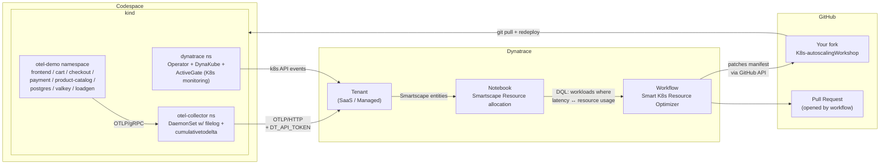

# K8s Autoscaling Workshop

> **Smart Kubernetes resource optimization with Dynatrace + OpenTelemetry**
> A 30-minute workshop that boots an entire cluster + observability stack
> from a GitHub Codespace, then uses a Dynatrace workflow to auto-tune
> CPU/memory requests by opening pull requests against your repository.

## What you'll build

By the end of this workshop you'll have:

- A single-node [`kind`](https://kind.sigs.k8s.io) cluster running inside a GitHub Codespace
- The [`opentelemetry-demo-light`](https://github.com/henrikrexed/opentelemetry-demo-light) application (5 microservices, postgres, valkey, k6 load generator)
- An OpenTelemetry Collector shipping traces / metrics / logs to your Dynatrace tenant — including pod logs via the **filelog** receiver and **cumulative-to-delta** metric conversion
- The Dynatrace Operator with a **DynaKube** (namespace-scoped — only namespaces labeled `oneagent=true` get OneAgent injection)
- A Dynatrace **notebook** (pre-provisioned) + **workflow** (imported from a template in this repo) that:
    1. Queries Smartscape for workloads where latency correlates with resource usage
    2. Computes optimal CPU/memory based on 7-day p95 usage
    3. Patches the manifest in **your fork** of this repo via the GitHub Contents API
    4. Opens a pull request with the proposed changes

## Architecture

## Workshop structure

-   :material-rocket-launch: **[1. Getting Started](getting-started.md)**

    ---

    Sign up for a Dynatrace trial (or use yours), generate the API tokens, configure Codespace secrets, fork the repo.

-   :material-laptop: **[2. Workshop](workshop.md)**

    ---

    Open the Codespace, watch the bootstrap, verify the deployment, run the resource-optimization workflow.

-   :material-broom: **[3. Cleanup](cleanup.md)**

    ---

    Tear down the kind cluster, delete the Codespace, remove the tenant resources.

## Prerequisites

- A **GitHub account** that can create Codespaces (the free 60-hour/month tier is plenty)
- A **Dynatrace tenant** — [sign up for a free 15-day trial](https://dt-url.net/observable-trial) if you don't have one
- Ability to fork a public GitHub repository

You do **not** need:

- A local Kubernetes cluster
- `kubectl`, `helm`, or `kind` installed on your laptop — the Codespace provisions them
- `dtctl` — the notebook and workflow are already deployed on the trial tenant

## Watch the video

A walk-through of the workshop is on the *Observe & Resolve* YouTube channel — [link once published].
