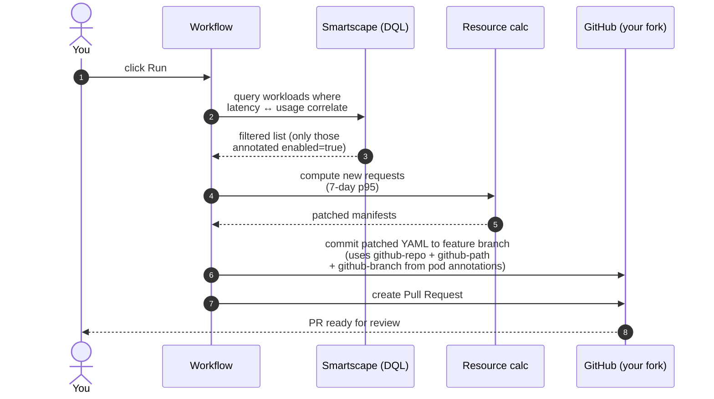

# 2. Workshop

This page runs you through the deployment, verifies it landed correctly, then walks the resource-optimization workflow end-to-end. About **20 minutes**.

## Step 1 — Open the Codespace

On your fork of `K8s-autoscalingWorkshop`, click **Code → Codespaces → Create codespace on main**.

The Codespace takes ~90 seconds to provision. When it's ready, a terminal opens automatically and runs `.devcontainer/bootstrap.sh`.

## Step 2 — Watch the bootstrap

You'll see the bootstrap output in real time. The phases are:

1. **Tool install** — `kind`, `yq`, `jq` get installed (~30s, cached on subsequent rebuilds).
2. **Annotation rewrite** — bootstrap detects your fork and rewrites + pushes the resource-optimization annotations on every workload. Look for `==> Codespace name: …` and `rewrite-annotations: rewrote N files`.
3. **Cluster create** — kind builds a single-node cluster named after your `$CODESPACE_NAME` (e.g. `henrikrexed-shiny-spork-x73r9pqgrcv544r`).
4. **Dynatrace Operator** — `helm install dynatrace-operator` runs, the operator's webhook pod becomes Ready, then the DynaKube CR is applied. ActiveGate spins up in the `dynatrace` namespace.
5. **OpenTelemetry Collector** — RBAC, secret, and the DaemonSet are applied. The collector starts tailing `/var/log/pods` immediately.
6. **otel-demo-light** — every Service / Deployment / StatefulSet from `otel-demo-light/` is applied via `kubectl apply -k`. `shared-env.yaml` gets the `OTEL_SERVICE_PREFIX` substituted from your Codespace secret.

The resource-optimization **notebook** is already deployed on the trial
Dynatrace tenant. You'll import the **workflow** yourself in step 4.

When all phases complete, the script prints a green summary with the cluster name and a list of UIs to open. Continue below.

!!! tip "Re-running the bootstrap"
    The bootstrap is idempotent. If anything fails partway, fix the cause and run `bash .devcontainer/bootstrap.sh` again — it'll skip the work that already succeeded (cluster exists, charts already installed, etc.).

## Step 3 — Verify the deployment

In the Codespace terminal:

=== "All pods"

    ```bash
    kubectl get pods -A
    ```

    You should see:

    - 3-4 pods in `dynatrace` (operator + activegate + csi-driver)
    - 1 pod in `otel-collector` (the DaemonSet)
    - 8 pods in `otel-demo` (frontend, cart, checkout, payment, product-catalog, postgres, valkey, load-generator)

=== "Demo telemetry"

    ```bash
    kubectl -n otel-collector logs ds/otel-collector --tail 50
    ```

    You should see `info` logs about traces, metrics, and logs flowing through the pipelines. Errors here usually mean a wrong token or tenant URL.

=== "Dynatrace tenant"

    Open your Dynatrace tenant. Within 1-2 minutes:

    - **Services** app: services appear with their `OTEL_SERVICE_PREFIX` prefix (e.g. `REX-cart`, `REX-frontend`)
    - **Kubernetes** app: your cluster shows up, named after `$CODESPACE_NAME`
    - **Notebooks** app: the *Smartscape Resource allocation* notebook is listed
    - **Workflows** app: the *Smart K8s Resource Optimizer* workflow is listed (after you import it in step 4)

## Step 4 — Import the workflow and configure the GitHub connection

The workflow template is included in the repo at `dynatrace/smart-resource-optimizer.workflow-template.yaml`. You need to upload it into Dynatrace and wire up the GitHub connection.

### 4a. Import the workflow

1. In Dynatrace, open the **Workflows** app
2. Click **Upload** in the top-right corner
3. Select the file `dynatrace/smart-resource-optimizer.workflow-template.yaml` from your Codespace (download it first, or copy-paste its contents)
4. The workflow *Smart K8s Resource Optimizer* appears in your list

!!! tip "Download from the Codespace"
    In VS Code, right-click `dynatrace/smart-resource-optimizer.workflow-template.yaml` in the file explorer and choose **Download**. Then upload that file into Dynatrace.

### 4b. Create a GitHub connection

The workflow commits patched manifests and opens pull requests against your fork. It needs a GitHub connection backed by the Personal Access Token you created in [Getting Started](getting-started.md#gather-details-create-a-github-personal-access-token).

1. In Dynatrace, go to **Settings → Connections → Add connection**
2. Choose **GitHub**
3. Enter a name (e.g. `My GitHub`)
4. Paste your GitHub Personal Access Token
5. Save the connection

### 4c. Wire the connection into the workflow

1. Open the imported workflow *Smart K8s Resource Optimizer*
2. The workflow shows an input prompt for a **GitHub connection** — select the connection you just created
3. Save the workflow

Without the GitHub connection the workflow will run but the *commit* and *create PR* steps will fail — everything else (Smartscape query, resource calculation) still works.

## Step 5 — Browse the load generator

The Codespace forwards port **8080** automatically. Click the **PORTS** tab in the bottom of VS Code, then click the globe icon next to *8080* to open the otel-demo-light frontend in a browser. The k6 load generator is already hammering it from inside the cluster — refresh a few times to confirm the demo works.

## Step 6 — Run the workflow manually

The workflow can be triggered on demand.

1. **Open the notebook** in Dynatrace (`Smartscape Resource allocation`)
2. Run the cells — you'll see a list of workloads, each with their current CPU/memory requests vs the 7-day p95 of actual usage
3. **Open the workflow** (`Smart K8s Resource Optimizer`)
4. Click **Run** in the top right

What happens:



When it completes, look in your fork's **Pull requests** tab. You should see one new PR per workload that exceeded the optimization threshold, each containing a diff against the matching `otel-demo-light/<service>.yaml` file with adjusted CPU/memory requests.

## Step 7 — Apply the PR and observe the change

1. Review one of the PRs (start with `cart.yaml` or `checkout.yaml`)
2. Merge it
3. In the Codespace, pull and reapply:
   ```bash
   git pull
   kubectl apply -k otel-demo-light/
   ```
4. Watch the pods restart with the new resource requests:
   ```bash
   kubectl -n otel-demo get pod -w
   ```

A few minutes later, the Dynatrace **Kubernetes** app reflects the new requests against the actual usage — the gap between request and usage shrinks, which is the win.

## What you just observed

- **Annotations as a contract** — the workflow learns where to patch the file by reading three annotations off the live pod. No central config, no service registry to keep in sync.
- **Fork-aware bootstrap** — the bootstrap rewrites annotations to point at the attendee's repo automatically, so 50 attendees in one classroom can each open their own PR with no cross-talk.
- **Delta metric ingestion** — the OTel collector's `cumulativetodelta` processor smooths the impedance mismatch between SDKs that emit cumulative and Dynatrace's preferred delta model.
- **Pod-log fan-out** — the `filelog` receiver tails `/var/log/pods/*/*/*.log` from the host node; you get application logs in Dynatrace without any sidecar changes to demo-light.

When you're done, continue to **[3. Cleanup](cleanup.md)**.
